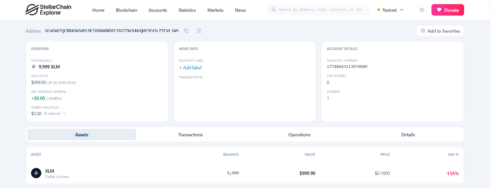
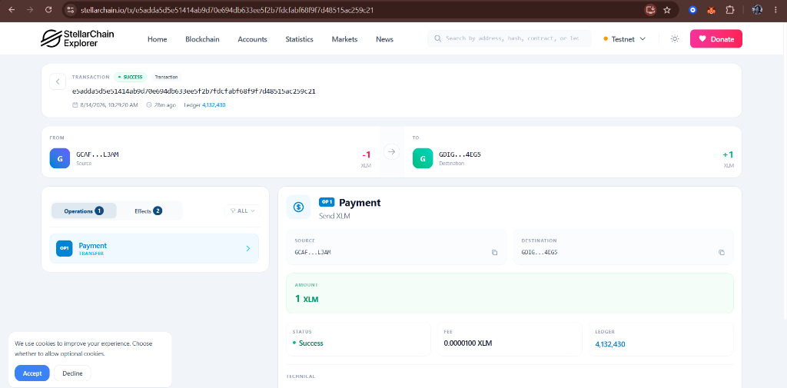

# Stellar Testnet — Go Backend

A backend application built in **Go** that demonstrates core Stellar blockchain operations on the **Stellar Testnet**. The project covers end-to-end wallet lifecycle management — from keypair generation and account funding to native XLM payments and on-chain transaction history retrieval.

---

## Features

| # | Feature | Description |
|---|---------|-------------|
| 1 | **Keypair Generation** | Generates cryptographic Ed25519 keypairs (sender & receiver) using the Stellar SDK |
| 2 | **Friendbot Funding** | Activates accounts on the Testnet via Stellar's Friendbot faucet (10,000 XLM each) |
| 3 | **Horizon Account Lookup** | Queries the Horizon API for on-chain account details — ID, sequence number, and balances |
| 4 | **XLM Payment Transaction** | Builds, signs, and submits a 1 XLM native payment from sender to receiver |
| 5 | **Transaction History** | Retrieves and displays the sender's full transaction history from Horizon |

---

## Tech Stack

| Component | Technology |
|-----------|------------|
| **Language** | Go 1.26 |
| **Stellar SDK** | [`github.com/stellar/go-stellar-sdk`](https://github.com/stellar/go-stellar-sdk) v0.7.1 |
| **Network** | Stellar Testnet |
| **Horizon Server** | `https://horizon-testnet.stellar.org` (via `DefaultTestNetClient`) |
| **Friendbot** | `https://friendbot-testnet.stellar.org` |

### SDK Packages Used

```
github.com/stellar/go-stellar-sdk/keypair          — Ed25519 keypair generation
github.com/stellar/go-stellar-sdk/clients/horizonclient — Horizon API client (account lookup, tx submission, tx history)
github.com/stellar/go-stellar-sdk/txnbuild          — Transaction construction (Payment, NativeAsset, TransactionParams)
github.com/stellar/go-stellar-sdk/network            — Network passphrase for transaction signing
```

---

## How `main.go` Works

The entire application runs sequentially in a single `main()` function:

```
1. Generate Sender Keypair     →  keypair.MustRandom()
2. Fund Sender via Friendbot   →  HTTP GET to Friendbot endpoint
3. Query Sender on Horizon     →  horizonclient.AccountRequest + AccountDetail()
4. Generate Receiver Keypair   →  keypair.MustRandom()
5. Fund Receiver via Friendbot →  HTTP GET to Friendbot endpoint
6. Build & Submit Payment      →  txnbuild.Payment (1 XLM, NativeAsset)
                                  → txnbuild.NewTransaction() → Sign() → SubmitTransaction()
7. Fetch Transaction History   →  horizonclient.TransactionRequest + Transactions()
```

### Transaction Construction Details

- **Operation**: `txnbuild.Payment` with `txnbuild.NativeAsset{}` (XLM)
- **Source Account**: Fetched from Horizon with current sequence number
- **Sequence Handling**: `IncrementSequenceNum: true` auto-increments the sequence
- **Base Fee**: `txnbuild.MinBaseFee` (100 stroops)
- **Time Bounds**: 300-second timeout via `txnbuild.NewTimeout(300)`
- **Signing**: Signed with `network.TestNetworkPassphrase` and the sender's full keypair

---

## Testnet Verification

All transactions are executed on the **Stellar Testnet** and can be independently verified on [StellarChain Explorer](https://stellarchain.io) (with the Testnet toggle enabled).

### Account Overview

The sender account after the payment — showing a balance of **9,999 XLM** (10,000 funded − 1 XLM sent):



### Payment Transaction

The 1 XLM payment transaction on-chain — confirmed with **Success** status, fee of **0.0000100 XLM**, recorded on the Stellar ledger:



---

## Getting Started

### Prerequisites

- [Go](https://go.dev/dl/) 1.21 or later
- Internet connection (for Testnet Friendbot and Horizon API calls)

### Run

```bash
# Clone the repository
git clone https://github.com/aishwarya-m-260803/stellar-testnet-go.git
cd stellar-testnet-go

# Download dependencies
go mod tidy

# Run the application
go run main.go
```

### Sample Output

```
=== Stellar Testnet Wallet ===
Public Key: GDSD6NMGWZZU4VGX6JGV2LARB75442QOOR4H5XPMYOXMG42SEYLCGVXP
Secret Key: SBNDMZSWW5LJFSAWED6HSMFLDJOGEGKMHPQOAU3AZIWXLZL6AMVSWY2U

=== Account Funded ===
{ "successful": true, "hash": "70cb4d83..." }

Your Stellar Testnet account is ready!

=== Horizon Account Details ===
Account ID: GDSD6NMGWZZU4VGX6JGV2LARB75442QOOR4H5XPMYOXMG42SEYLCGVXP
Sequence: 17747191414128640
Balances:
  - Type: native (XLM), Balance: 10000.0000000

=== Receiver Account ===
Public Key: GDSISXRBWBGTPB66J3FGUAGUTJQIGCHVOCHEKOXZ72PBS2LZFCXIWYIP
Secret Key: SA4DMQMTYY6P2BSZWYRIN3RFPZZSNN3WA52C6Q2ZMDSHUPBVJRWWYGOT
Receiver account funded via Friendbot

=== Payment Sent ===
Transaction Hash: a77431bfcb30233c8dcb72414b3c613c...
Successful: true
1 XLM sent from sender to receiver!

=== Sender Transaction History ===
Transaction #1
  Hash:            a77431bfcb30233c...
  Ledger:          4132422
  Created At:      2026-08-14 04:58:40 +0000 UTC
  Source Account:  GCSSNONYXMUMTAPF...
  Successful:      true
```

---

## Project Structure

```
stellar-testnet-go/
├── main.go            # Application entry point — all Stellar operations
├── go.mod             # Go module definition and dependencies
├── go.sum             # Dependency checksums
├── screenshots/       # Testnet verification screenshots
│   ├── account-overview.png
│   └── payment-transaction.png
└── .gitignore         # Ignores binaries, secrets, IDE files
```

---

## License

This project is for educational and demonstration purposes on the Stellar Testnet.
